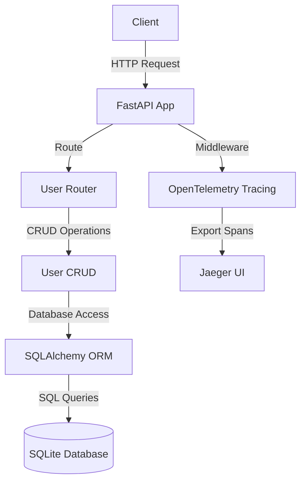
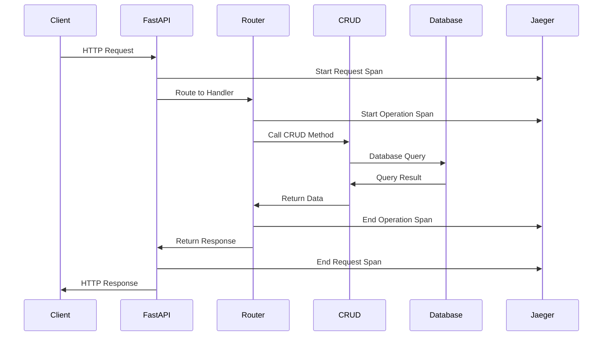

# Application Architecture

## Overview

This document describes the architecture of our FastAPI application with OpenTelemetry tracing.

## Component Diagram

```mermaid
graph TD
    Client[Client] -->|HTTP Request| FastAPI[FastAPI App]
    FastAPI -->|Middleware| Tracing[OpenTelemetry Tracing]
    FastAPI -->|Route| UserRouter[User Router]
    UserRouter -->|CRUD Operations| UserCRUD[User CRUD]
    UserCRUD -->|Database Access| SQLAlchemy[SQLAlchemy ORM]
    SQLAlchemy -->|SQL Queries| Database[(SQLite Database)]
    Tracing -->|Export Spans| Jaeger[Jaeger UI]
```

## Request Flow

```mermaid
sequenceDiagram
    participant Client
    participant FastAPI
    participant Router
    participant CRUD
    participant DB as Database
    participant Jaeger
    
    Client->>FastAPI: HTTP Request
    FastAPI->>Jaeger: Start Request Span
    FastAPI->>Router: Route to Handler
    Router->>Jaeger: Start Operation Span
    Router->>CRUD: Call CRUD Method
    CRUD->>DB: Database Query
    DB->>CRUD: Query Result
    CRUD->>Router: Return Data
    Router->>Jaeger: End Operation Span
    Router->>FastAPI: Return Response
    FastAPI->>Jaeger: End Request Span
    FastAPI->>Client: HTTP Response
```
