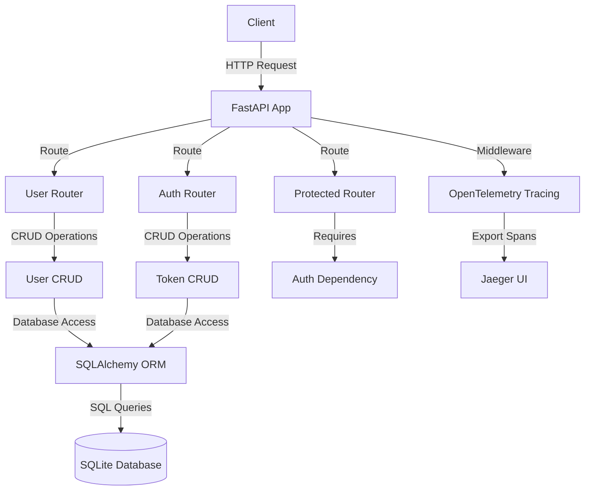
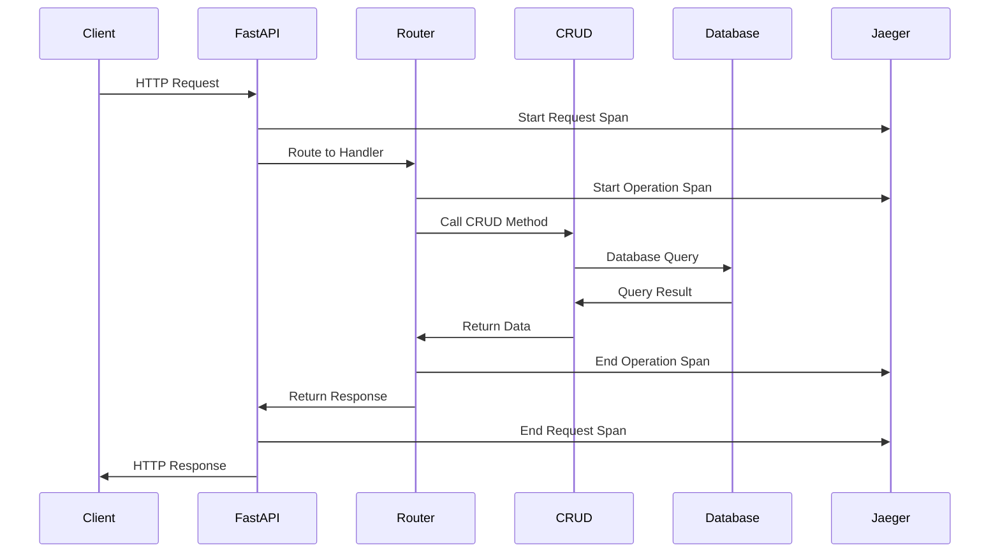
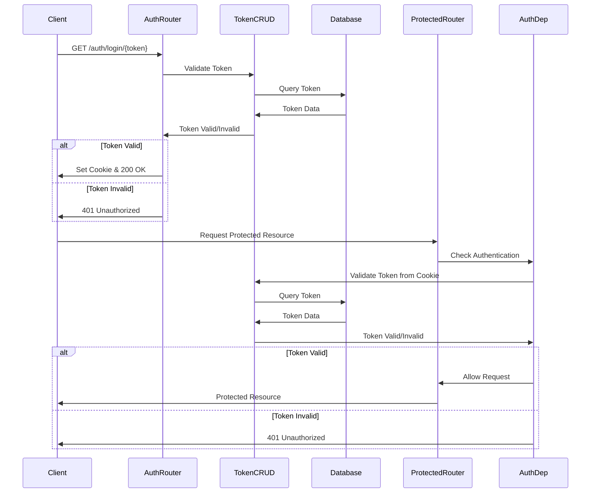

# Application Architecture

## Overview

This document describes the architecture of our FastAPI application with OpenTelemetry tracing and token-based authentication.

## Component Diagram

## Request Flow

## Authentication Flow

## Tracing Implementation

Our application uses OpenTelemetry to trace requests through the system. Key aspects:

1. **Span Creation**: Each route handler creates a span for the operation
2. **Events**: Important points in the request lifecycle are marked with events
3. **Attributes**: Spans include attributes for query parameters, results, and errors
4. **Visualization**: All traces are sent to Jaeger for visualization and analysis

## Authentication Implementation

The application uses a token-based authentication system:

1. **Access Tokens**: Tokens are created and stored in the database with the following attributes:
   - Name: A human-readable identifier
   - Token: A unique string used for authentication
   - Created At: Timestamp when the token was created
   - Expires At: Optional expiration timestamp
   - Is Active: Boolean indicating if the token is still valid

2. **Login**: Users authenticate by visiting `/auth/login/{token}`, which:
   - Validates the token against the database
   - Sets an HTTP-only cookie with the token value
   - Returns a success message

3. **Session**: Authentication state is maintained via HTTP cookies:
   - The `access_token` cookie contains the token value
   - The cookie is HTTP-only for security
   - The cookie has a configurable expiration

4. **Logout**: Users can logout by visiting `/auth/logout`, which:
   - Clears the `access_token` cookie
   - Returns a success message

5. **Token Management**:
   - Tokens can be created via the `/auth/tokens` endpoint
   - Tokens can be listed via the `/auth/tokens` endpoint
   - Tokens can be invalidated via the `/auth/tokens/{token_id}` endpoint

6. **Authentication Check**: The `/auth/check` endpoint allows clients to verify their authentication status

## Testing Strategy

The application includes a comprehensive test suite using pytest:

1. **Test Database**: Tests use an in-memory SQLite database to isolate from the production database
2. **Fixtures**: Reusable test fixtures provide database sessions, test clients, and authentication
3. **Mocking**: The OpenTelemetry tracer is mocked to prevent connection attempts to Jaeger during tests
4. **Test Coverage**: Tests cover user operations, authentication flows, and protected routes

## Deployment

The application is deployed using Docker Compose with the following services:

1. **FastAPI**: The main application container
2. **Jaeger**: For collecting and visualizing traces

Environment variables and volume mounts are configured to ensure proper communication between services.
