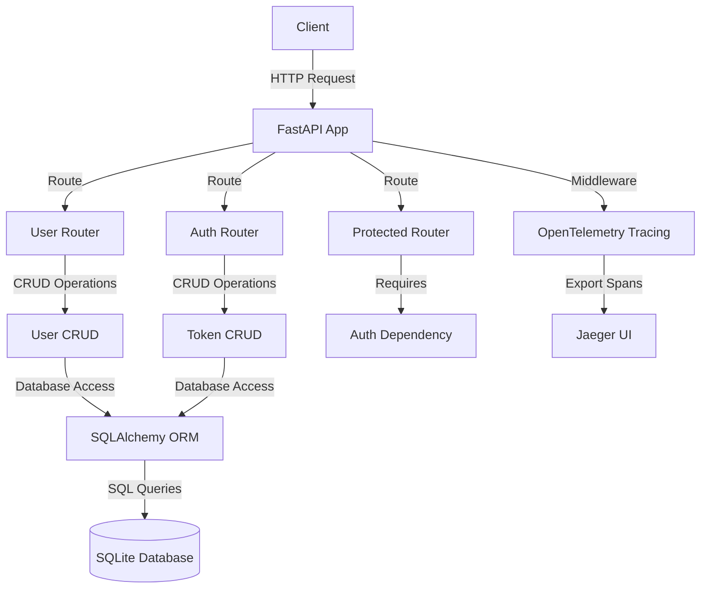
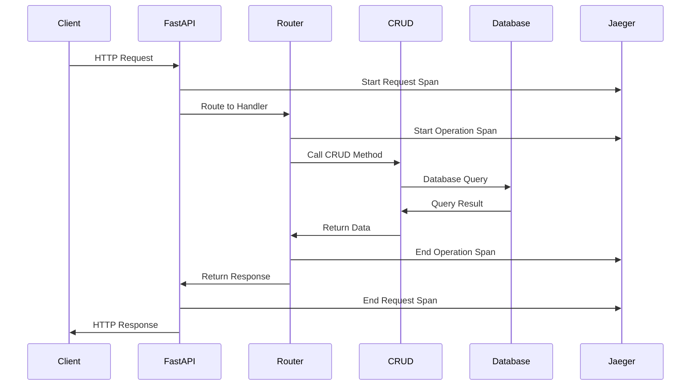
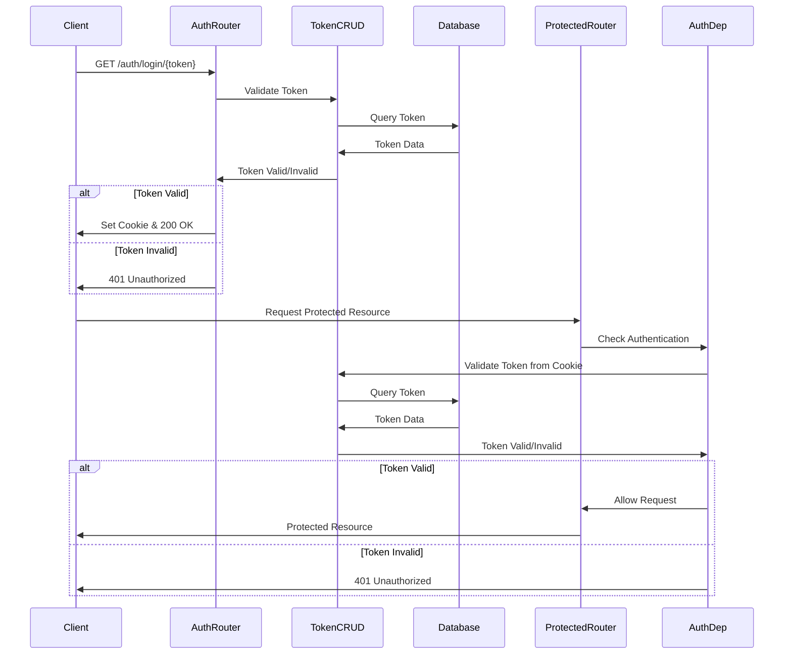
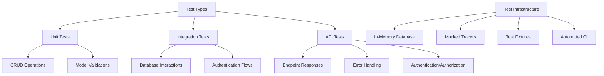
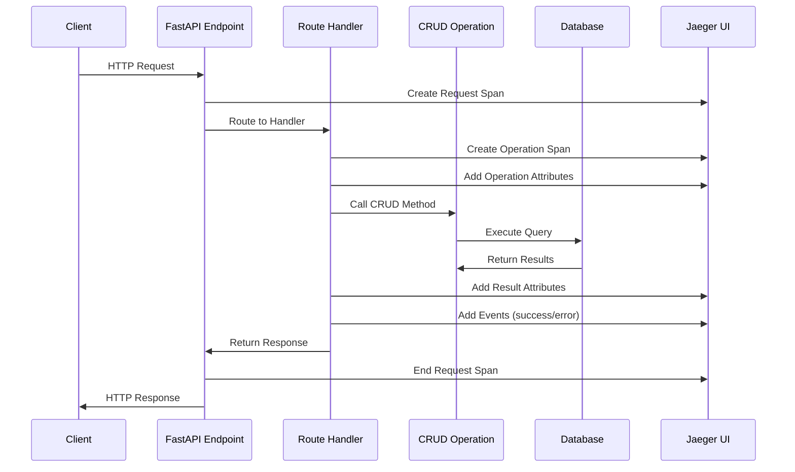
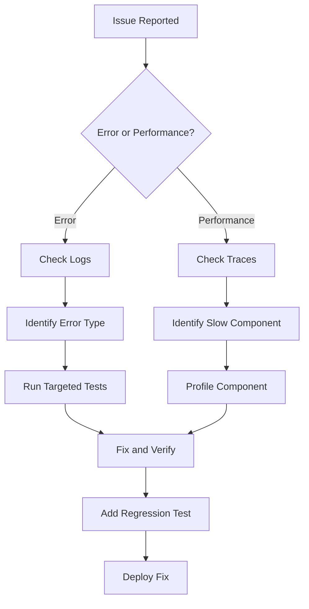
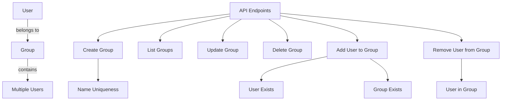

# Application Architecture

## Overview

This document describes the architecture of our FastAPI application with OpenTelemetry tracing and token-based authentication.

## Component Diagram



## Request Flow



## Authentication Flow



## Debuggability and Observability

Our application is designed with debuggability and observability as core principles, ensuring issues can be quickly identified and resolved.

### Testing Strategy



Our testing approach ensures code quality and prevents regressions:

- **Test Coverage**: Tests cover all critical paths including user operations, authentication flows, and group management
- **Isolation**: Each test runs with a clean database state
- **Fixtures**: Reusable components provide database sessions, authenticated clients, and test data
- **Mocking**: External dependencies like tracers are mocked to ensure tests are reliable and fast

### Tracing Implementation



Our tracing strategy provides deep visibility into application behavior:

- **Hierarchical Spans**: Each operation creates a span within the request span
- **Rich Attributes**: Spans include query parameters, entity IDs, and result metadata
- **Event Timeline**: Key points in request processing are marked with timestamped events
- **Error Tracking**: Exceptions and error conditions are captured with context
- **Performance Metrics**: Execution times are recorded for performance analysis

### Debugging Workflow



Our debugging workflow is streamlined through:

- **Structured Logging**: Consistent log format with correlation IDs linking to traces
- **Trace Visualization**: Jaeger UI provides timeline views of request processing
- **Test Reproduction**: Issues can be reproduced and verified with targeted tests
- **Middleware Insights**: Request processing times are captured by middleware

### Group Management Visualization



The group management system provides:

- **One-to-Many Relationship**: Each user belongs to at most one group
- **Validation Rules**: Enforces unique group names and valid references
- **Flexible Membership**: Users can be added to or removed from groups
- **Soft Deletion**: Groups can be marked inactive without losing data

## Authentication Implementation

The application uses a token-based authentication system:

1. **Access Tokens**: Tokens are created and stored in the database with the following attributes:
   - Name: A human-readable identifier
   - Token: A unique string used for authentication
   - Created At: Timestamp when the token was created
   - Expires At: Optional expiration timestamp
   - Is Active: Boolean indicating if the token is still valid

2. **Login**: Users authenticate by visiting `/auth/login/{token}`, which:
   - Validates the token against the database
   - Sets an HTTP-only cookie with the token value
   - Returns a success message

3. **Session**: Authentication state is maintained via HTTP cookies:
   - The `access_token` cookie contains the token value
   - The cookie is HTTP-only for security
   - The cookie has a configurable expiration

4. **Logout**: Users can logout by visiting `/auth/logout`, which:
   - Clears the `access_token` cookie
   - Returns a success message

5. **Token Management**:
   - Tokens can be created via the `/auth/tokens` endpoint
   - Tokens can be listed via the `/auth/tokens` endpoint
   - Tokens can be invalidated via the `/auth/tokens/{token_id}` endpoint

6. **Authentication Check**: The `/auth/check` endpoint allows clients to verify their authentication status

## Deployment

The application is deployed using Docker Compose with the following services:

1. **FastAPI**: The main application container
2. **Jaeger**: For collecting and visualizing traces

Environment variables and volume mounts are configured to ensure proper communication between services.

## Database Implementation Details

### DateTime Handling

Our application uses SQLite as the database backend, which requires special handling for datetime objects:

1. **Issue**: SQLite's DateTime type only accepts Python datetime objects, not string representations.

2. **Challenge**: When processing API requests, datetime values arrive as strings and need conversion.

3. **Solution**: We implemented a two-part approach:
   - **Schema Validation**: Pydantic validators in schemas (e.g., `ShiftCreate`) convert string datetimes to Python datetime objects
   - **CRUD Method Override**: Custom implementation of the `create` method in `CRUDShift` preserves datetime objects by avoiding `jsonable_encoder`

4. **Implementation Example**:
   ```python
   # In app/schemas/shift.py
   @validator('start_time', 'end_time', pre=True)
   def parse_datetime(cls, value):
       if isinstance(value, str):
           # Convert string to datetime object
           return datetime.fromisoformat(value.replace('Z', '+00:00'))
       return value
   
   # In app/crud/shift.py
   def create(self, db: Session, *, obj_in: ShiftCreate) -> Shift:
       # Direct attribute access preserves datetime objects
       db_obj = Shift(
           title=obj_in.title,
           start_time=obj_in.start_time,  # Remains a datetime object
           end_time=obj_in.end_time,      # Remains a datetime object
           # ...
       )
       # ...
   ```

This approach ensures proper handling of datetime values throughout the application lifecycle, from API request to database storage.
