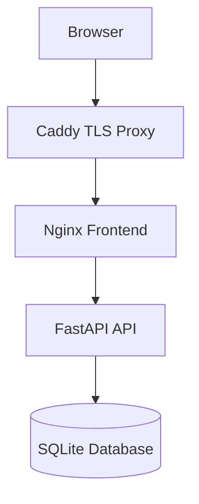

# Application Architecture

## Overview

The Open Flair Shift Planner is a small FastAPI and React application designed for a coordinator-run volunteer planning workflow.

The current target is a Docker deployment on a home server or small VPS. Public internet exposure is supported only with HTTPS and configured access codes.

## Components

```mermaid
graph TD
    Browser[Browser] --> Caddy[Caddy TLS Proxy]
    Caddy --> Frontend[Nginx Frontend]
    Frontend --> API[FastAPI API]
    API --> SQLite[(SQLite Database)]
```

## Request Flow

1. Members enter the shared event access code.
2. The backend validates the code and sets a signed HTTP-only session cookie.
3. Members create or recover their account by email.
4. Members mark shifts, days, or locations as available/unavailable.
5. The coordinator generates a first-pass plan and manually adjusts assignments.

## Deployment

- Development compose exposes the frontend on `3000` and backend on `8000`.
- Production compose exposes Caddy on `80` and `443`.
- The frontend and backend are available only inside the compose network in production.
- SQLite data is persisted in `./data`.
- Production requires `APP_DOMAIN`, `EVENT_CODE`, `COORDINATOR_CODE`, and `SESSION_SECRET_KEY`.
- `COOKIE_SECURE=true` is the default for production and requires HTTPS in front of the app.

## Current Security Boundary

The event code is a lightweight invitation barrier, not a personal password. Participant access can create or recover accounts by email. Coordinator actions require a separate coordinator code and backend-side role checks.

The app should still avoid storing sensitive personal data. The intended data lifecycle is one event season; delete or archive the SQLite database after the event.
