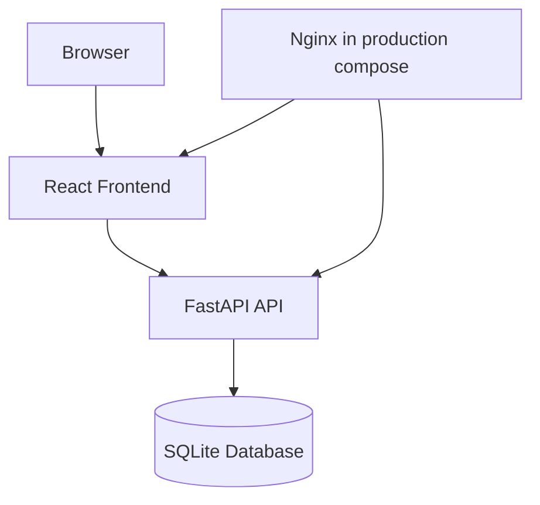

# Application Architecture

## Overview

The Open Flair Shift Planner is a small FastAPI and React application designed for a coordinator-run volunteer planning workflow.

The current target is a local or home-server deployment. The old external tracing and public DNS deployment assumptions are no longer part of the active architecture.

## Components

```mermaid
graph TD
    Browser[Browser] --> Frontend[React Frontend]
    Frontend --> API[FastAPI API]
    API --> SQLite[(SQLite Database)]
    Nginx[Nginx in production compose] --> Frontend
    Nginx --> API
```

## Request Flow

1. Members open a token link or enter a token manually.
2. The backend validates the token and sets an HTTP-only cookie.
3. Members create or recover their account by email.
4. Members mark shifts, days, or locations as available/unavailable.
5. The coordinator generates a first-pass plan and manually adjusts assignments.

## Deployment

- Development compose exposes the frontend on `3000` and backend on `8000`.
- Production compose exposes Nginx on `80`.
- The backend is available only inside the compose network in production.
- SQLite data is persisted in `./data`.

## Current Security Boundary

This app should be treated as LAN/trusted-network software until authorization is tightened. Token-based authentication exists, but coordinator-only backend authorization is not yet complete.
