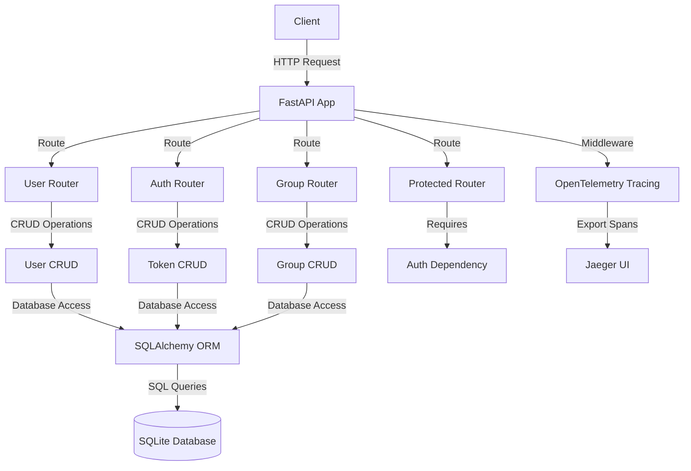
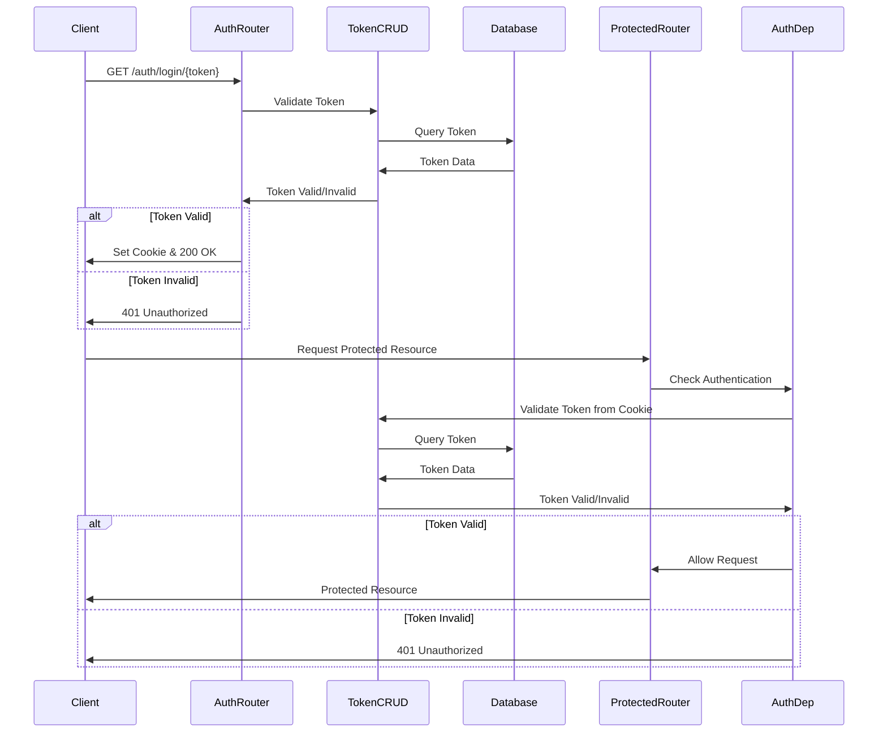
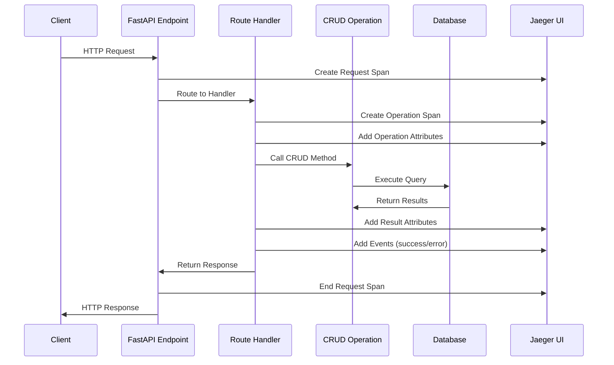
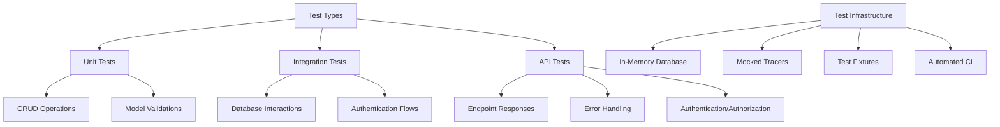
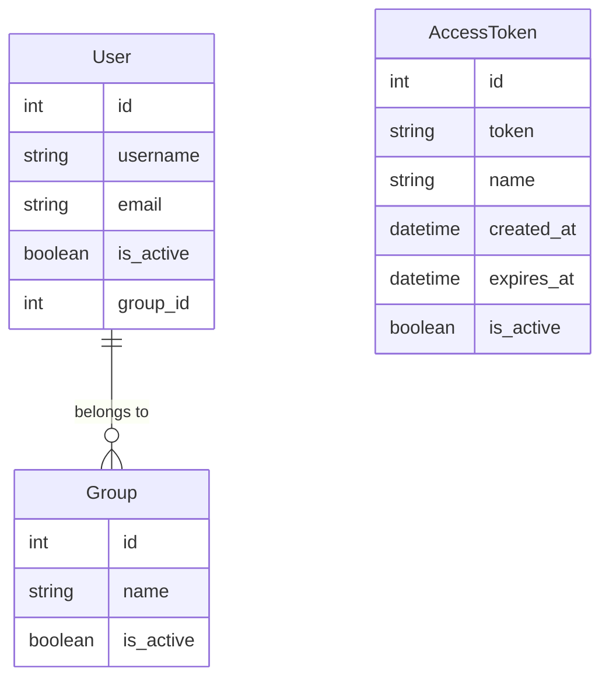

# Application Architecture Overview

This document provides a high-level overview of our FastAPI application with OpenTelemetry tracing and token-based authentication.

## Component Diagram



## Key Design Decisions

1. **API-First Design**: The application is built as a RESTful API service
2. **Modular Structure**: Code is organized by feature with clear separation of concerns
3. **Observability**: Comprehensive tracing is built into all operations
4. **Authentication**: Token-based authentication with HTTP-only cookies
5. **Data Relationships**: Users belong to at most one group (one-to-many relationship)

For more details, see the following documents:
- [Authentication Flow](./authentication.md)
- [Tracing Implementation](./tracing.md)
- [Testing Strategy](./testing.md)
- [Data Models](./data_models.md)

# Authentication Implementation

## Overview

The application uses a token-based authentication system designed for simplicity and security.

## Authentication Flow



## Token Management

1. **Access Tokens**: Tokens are created and stored in the database with the following attributes:
   - Name: A human-readable identifier
   - Token: A unique string used for authentication
   - Created At: Timestamp when the token was created
   - Expires At: Optional expiration timestamp
   - Is Active: Boolean indicating if the token is still valid

2. **Token Creation**: Administrators create tokens via the API:
   ```
   POST /auth/tokens/
   {
     "name": "User Access Token",
     "expires_in_days": 30
   }
   ```

3. **Token Distribution**: Administrators distribute tokens to users via email links:
   - Example link: `https://your-app.com/login?token=abc123`
   - When users click the link, they are authenticated

4. **Authentication Process**:
   - User visits `/auth/login/{token}` (directly or via frontend)
   - System validates the token
   - If valid, sets an HTTP-only cookie with the token
   - User is now authenticated for subsequent requests

5. **Session Management**:
   - Authentication state is maintained via HTTP cookies
   - The cookie is HTTP-only for security
   - The cookie has a configurable expiration

6. **Logout**: Users can logout by visiting `/auth/logout`

This approach provides a simple authentication mechanism without requiring users to remember passwords.

# Tracing Implementation

## Overview

Our application uses OpenTelemetry to provide comprehensive tracing of all operations, enabling detailed performance analysis and debugging.

## Tracing Flow



## Implementation Details

1. **Span Creation**: Each route handler creates a span for the operation:
   ```python
   with tracer.start_as_current_span("operation-name") as span:
       # Operation code
   ```

2. **Span Attributes**: Spans include attributes for context:
   ```python
   span.set_attribute("user.id", user_id)
   span.set_attribute("query.limit", limit)
   ```

3. **Event Timeline**: Important points are marked with events:
   ```python
   span.add_event("database_query_started")
   span.add_event("database_query_completed", {"execution_time_ms": time_ms})
   ```

4. **Error Tracking**: Exceptions are captured in spans:
   ```python
   span.set_attribute("error", "User not found")
   ```

5. **Visualization**: All traces are sent to Jaeger for analysis

## Testing Considerations

In test environments, the tracer is mocked to prevent connection attempts to Jaeger:

```python
# From tests/conftest.py
mock_tracer = MagicMock()
mock_span = MagicMock()
mock_tracer.start_as_current_span.return_value.__enter__.return_value = mock_span

# Apply the patch
tracer_patch = patch('opentelemetry.trace.get_tracer', return_value=mock_tracer)
tracer_patch.start()
```

This mocking is necessary because tests run outside the Docker environment where Jaeger is available.

# Testing Strategy

## Overview

Our application includes a comprehensive test suite to ensure reliability and prevent regressions.

## Test Types



## Key Testing Principles

1. **Isolation**: Each test runs with a clean database state
2. **Fixtures**: Reusable components provide database sessions, authenticated clients, and test data
3. **Mocking**: External dependencies like tracers are mocked to ensure tests are reliable and fast
4. **Coverage**: Tests cover all critical paths including user operations, authentication flows, and group management

## Test Database

Tests use an in-memory SQLite database to isolate from the production database:

```python
SQLALCHEMY_DATABASE_URL = "sqlite:///:memory:"
engine = create_engine(
    SQLALCHEMY_DATABASE_URL,
    connect_args={"check_same_thread": False},
    poolclass=StaticPool,
)
```

## Test Fixtures

Common test fixtures include:

1. **Database Session**: Creates a fresh database for each test
2. **Test Client**: Provides an HTTP client for API testing
3. **Authentication**: Creates tokens and authenticated clients
4. **Test Data**: Creates users, groups, and other entities needed for tests

## Running Tests

Tests can be run using pytest:

```bash
pytest
```

Or with coverage reporting:

```bash
pytest --cov=app
```

# Data Models

## Overview

Our application uses SQLAlchemy ORM to define and interact with data models. This document describes the key models and their relationships.

## Entity Relationship Diagram



## Key Relationships

### User-Group Relationship

- **Type**: One-to-Many
- **Description**: Each user belongs to at most one group, and each group can have multiple users
- **Implementation**:
  ```python
  # In User model
  group_id = Column(Integer, ForeignKey("groups.id"), nullable=True)
  group = relationship("Group", back_populates="users")
  
  # In Group model
  users = relationship("User", back_populates="group")
  ```

## Soft Deletion

All models include an `is_active` flag that allows for "soft deletion":

- When set to `False`, entities are considered inactive but remain in the database
- This preserves historical data while preventing their use in active operations
- For example, inactive tokens cannot be used for authentication

## Database Access

Database operations are encapsulated in CRUD (Create, Read, Update, Delete) classes:

- `CRUDBase`: Provides generic CRUD operations for all models
- `CRUDUser`: User-specific operations
- `CRUDToken`: Token-specific operations
- `CRUDGroup`: Group-specific operations

These classes provide a clean interface for database operations and help maintain separation of concerns.
