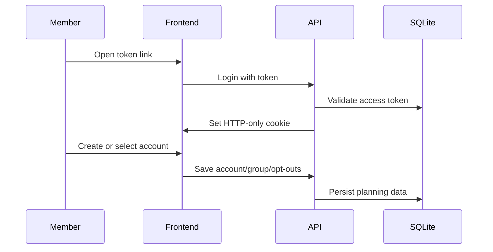
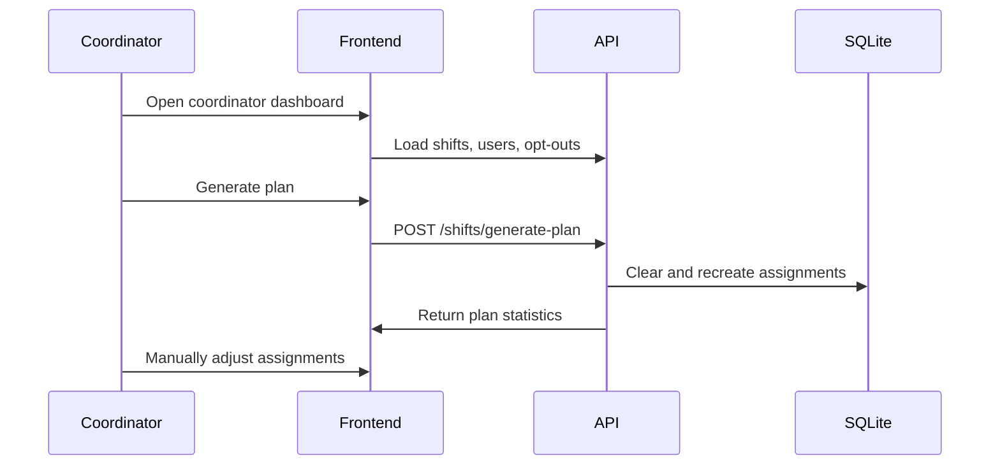

# Architecture Overview

The application is intentionally small:

- FastAPI serves the JSON API.
- React serves the member and coordinator UI.
- SQLite stores users, groups, shifts, tokens, assignments, and opt-outs.
- Nginx serves the frontend and proxies API routes in production compose.

The active deployment path is a home server or local LAN. Public DNS, HTTPS automation, and external tracing can be revisited later if the pilot needs them.

## Data Flow

```mermaid
sequenceDiagram
    participant Member
    participant Frontend
    participant API
    participant DB as SQLite

    Member->>Frontend: Open token link
    Frontend->>API: Login with token
    API->>DB: Validate access token
    API->>Frontend: Set HTTP-only cookie
    Member->>Frontend: Create or select account
    Frontend->>API: Save account/group/opt-outs
    API->>DB: Persist planning data
```

## Coordinator Flow

```mermaid
sequenceDiagram
    participant Coordinator
    participant Frontend
    participant API
    participant DB as SQLite

    Coordinator->>Frontend: Open coordinator dashboard
    Frontend->>API: Load shifts, users, opt-outs
    Coordinator->>Frontend: Generate plan
    Frontend->>API: POST /shifts/generate-plan
    API->>DB: Clear and recreate assignments
    API->>Frontend: Return plan statistics
    Coordinator->>Frontend: Manually adjust assignments
```

## Notes

- The old external tracing experiment has been removed from active code.
- The old public DNS and certificate config has been removed from active compose/Nginx config.
- Authorization hardening is still required before exposing real data beyond a trusted network.
